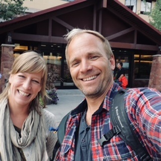

Leiv gjennomførte sitt doktorgradsprosjekt som ansatt ved Avdeling for barn og unges psykiske helse (ABUP) ved Sørlandet sykehus I sin studie utforsket han meningsdannelse hos ungdom og her kom det frem at mange unge mennesker opplevde mening i forbindelse med opphold i naturen Leiv var selv en friluftsentusiast og ble derfor opptatt av å utforske potensialet for helsefremming og meningssøking gjennom naturbaserte behandlingstilnærminger Han disputerte for sin doktorgrad i 2012 og begynte på samme tid å planlegge et klinisk utviklingsprosjekt som omhandlet nettopp sammenhengen mellom natur og helse. Kollegaer i ABUP, Carina Ribe Fernee og Gunnar Oland Åsen ble tidlig invitert inn for å bidra i dette utviklingsarbeidet. Både Carina og Gunnar hadde arbeidet en årrekke i ABUP og hadde selv erfaring med og interesse for naturbasert terapeutisk arbeid. De etablerte en prosjektgruppe hvor blant annet barnelege/forsker Leif T. Eskedal og medisinsk etiker/forsker Terje Mesel ble invitert med. Det ble utviklet en forskningsprotokoll og søkt om ekstern finansiering parallelt som den kliniske utprøving av naturbaserte gruppetilbud ble påbegynt. Med ekstern finansiering fra Sørlandets kompetansefond reiste først Leiv og Carina på sin første internasjonale konferanse nemlig Wilderness Therapy Symposium i Park City, USA, i 2014 (Bilde 2). 

