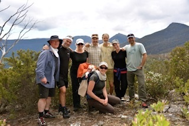

 

Dette ble deres første møte med naturbasert arbeid i USA, hvor det finnes mye kompetanse og forskning innen dette feltet. Senere samme år dro så Leiv, Carina og Gunnar på studiereise til Australia.Her var det flere sentrale miljøer både knyttet til klinisk praksis og forskning som ble avlagt besøk av den norske trioen. Denne reisen ble svært avgjørende for arbeidet videre da det var mye lærdom og inspirasjon å hente hos Australske kollegaer. Bildet (Bilde 3) er fra besøket hos Anita Pryor, Ben Knowles og Pete Rae ved Adventure Works på Tasmania.

