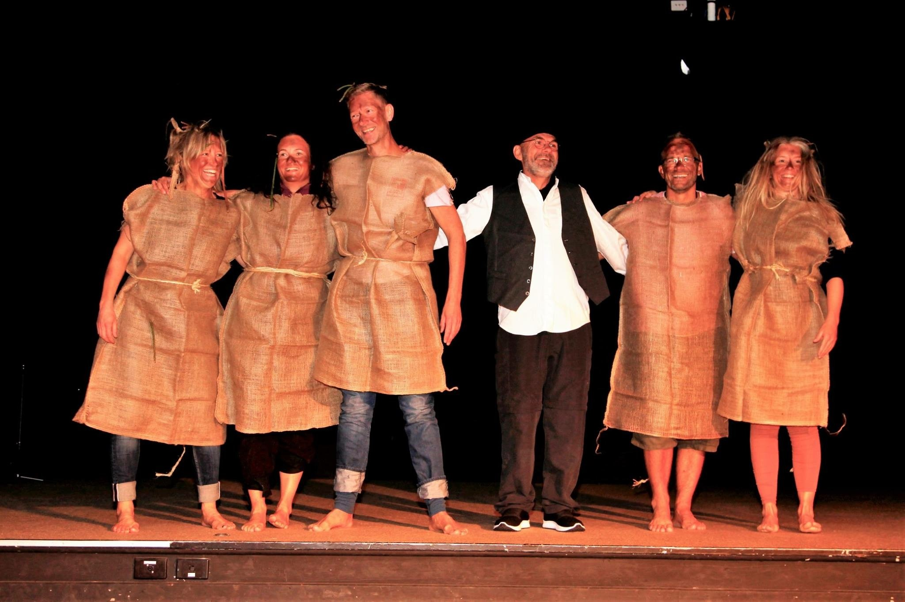

I 2015 var også året da Leiv og Carina deltok på sin første verdenskonferanse innen feltet. Det var den 7. konferansen i rekken av International Adventure Therapy Conference (7IATC) som ble avholdt i Denver,USA i juni dette året. Denne konferanserekken går av stabelen hvert tredje år og er også treffpunktet for det internasjonale samarbeidsorganet Adventure Therapy International Committee (ATIC).Leiv og Carina holdt her sin første internasjonale konferanseforedrag hvor de presenterte sine erfaringer med å starte opp et klinisk forskningsprosjekt innen spesialisthelsetjenesten i Norge. De ble svært godt mottatt, spesielt med tanke på at det sjelden deltok personer fra de nordiske landene på disse konferansene og mange var nysgjerrige på friluftslivskulturen i vår del av verden. Leiv og Carina ble invitert inn som de første norske representantene i ATIC, og ble også kjent med en tredje skandinaver som dukket opp på samme konferanse, nemlig Tinna J. Mariager, som senere etablerte Foreningen for Udendørsterapi Danmark og som i samarbeid med Leiv og Carina tok initiativ til å danne det første nordiske nettverket, senere kalt Nordic Outdoor Therapy Network (NOTN). Basert på kliniske erfaringer og tilbakemeldinger fra deltakerne i FT 1.0, utviklet vi så Friluftsterapi versjon 2.0 som ble prøvd ut i tidsrommet 2017-18. Denne versjonen var mer intensivert tidsmessig ved å foregå i en tre ukers periode. Dessuten forflyttet man seg lenger bort fra sivilisasjonen ved å tre inn i det vakre naturområdet Setesdals Austhei til vandreturen. I 2018 var allerede tre år gått siden forrige verdenskonferanse og da det var duket for The 8th International Adventure Therapy Conference (8IATC) var en langt større delegasjon samlet fra de nordiske landene og også fra Agder. Grunnen var at allerede på 7IATC ble drømmen sådd hos Leiv og Carina om å søke vertskap for verdenskonferansen seks år frem i tid. Selv om det hørtes vilt ut der og da, hadde de tro på at det kunne være tilstrekkelig tid for å bygge opp momentum i Agder og Norden. Et systematisk arbeid fulgte siden, hvor etter hvert både Kristiansand kommune Blå Kors og Universitetet i Agder ble med på «laget». På 8IATC i Australia ble det offentliggjort at vi hadde lyktes med visjonen og Agder-gruppen ble tildelt vertskapet for den 9. konferansen i rekken På 8IATC stod Abup for to innlegg på konferansen, både en forskningspresentasjon av Leiv og Carina, og i tillegg et plenumsforedrag hvor Gunnar, Vibeke Leiv og Carina som Team Norway presenterte vår tilnærming til naturbasert terapeutisk arbeid. Den ene kvelden hvor hver nasjon skulle presentere seg på en underholdende måte fremførte dessuten Gunnar et tradisjonelt norsk stev som ble etterfulgt av en svært ekspressiv trolldans til Dovregubbens hall, hvor også Janne og Leif Roar fra Energiverket i Kristiansand kommune deltok i dansetroppen (Bilde 5). 

