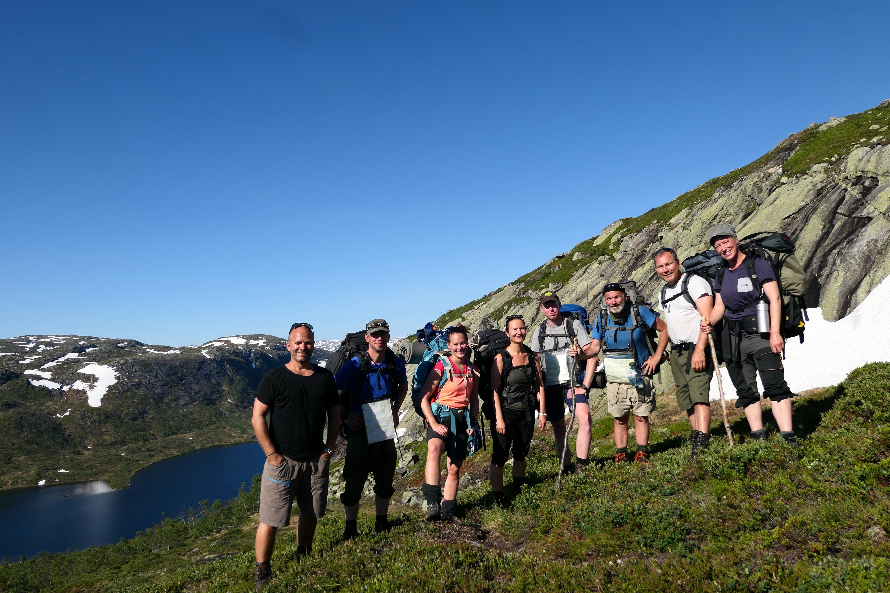

Siden 2018 har vi beveget oss over i en ny fase hvor vi gradvis har utvidet det naturbaserte tilbudet til å også inkludere diverse frilufts- og aktivitetsbaserte dagtilbud på samtlige av ABUPs tre lokasjoner.Vi har introdusert Basecamp i Kristiansand som er et fire timers dagtilbud for ungdom som ikke er i full skolegang. I både Lister og Arendal har de en tilsvarende friluftsgruppe,i tillegg til at de også har startet opp med kajakk og klatring som ukentlige aktivitetsbaserte tilnærminger til terapi i Arendal. I Kristiansand er det blitt integrert oppmerksomt nærvær-/mindfulnessøvelser, samt MediYoga,som en del av det naturbaserte tilbudet. Som et resultat av denne utvidede virksomheten, ble det besluttet at ABUPs friluftsteam fra 2019 skulle kalles for UT-teamet, eller utendørsterapiteamet.Videre planer inkluderer blant annet mer naturbasert familieorientert arbeid i fortsettelsen. 2020 skulle bli annerledesåret hvor en stor del av aktiviteten ble avlyst grunnet koronarestriksjoner.Da den planlagte friluftsterapituren i juni ble avlyst grunnet smittevernregler knyttet til gruppebehandling så vi muligheten for å gjennomføre en teamtreningstur i stedet og et bortimot fulltallig UT-team tilbrakte fire døgn sammen i Setesdals Austhei (Bilde 6). 

