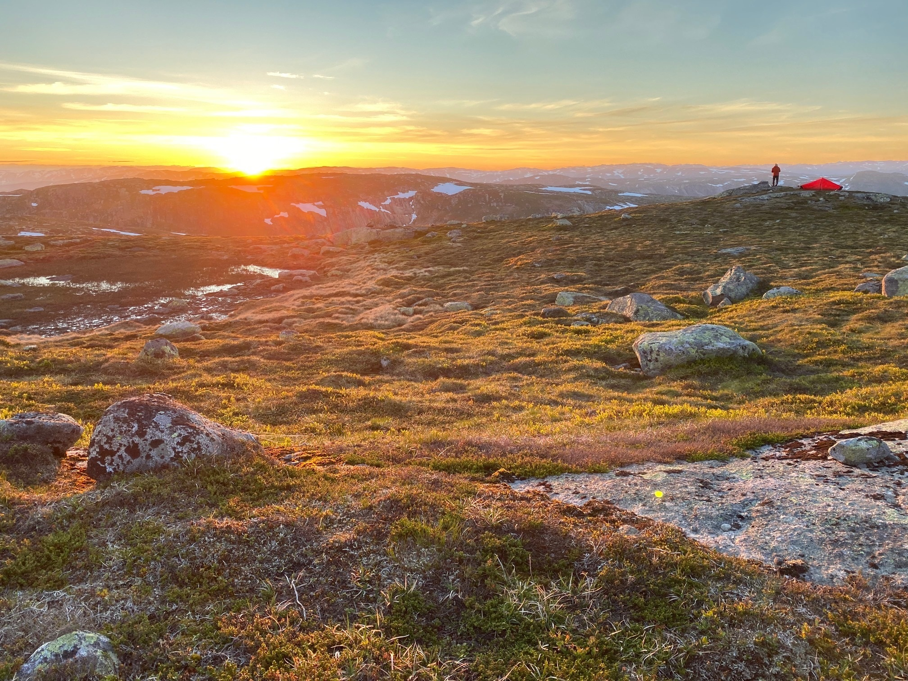

Det ble en magisk tur, hvor særlig den spektakulære solnedgangen på midtsommernatten som ble tilbrakt på toppen av Reinådalsheii, gjorde varig inntrykk (Bilde 7). 

Lite ante vi da at Leiv kort tid etter skulle bli diagnostisert med alvorlig kreftsykdom og at vi kun få måneder senere igjen samlet oss rundt ham, men denne gang i bisettelsen,hvor vi i «flokken» hans hadde brakt med oss gevirer fra Setesdals Austhei. Leiv er med oss videre i våre tanker og hjerter i det vi vandrer videre gjennom dette forunderlige livet.